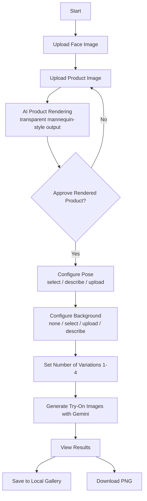

# AI Virtual Try-On Studio

AI Virtual Try-On Studio is a React + TypeScript web app that helps you create virtual fashion try-on images from a face photo and a clothing image using Google Gemini image generation.

---

## Why this project was made

Fashion creators and sellers often need many styled photos, but traditional photoshoots take time, planning, and cost.  
This project was made to quickly prototype outfit visuals with AI so users can test pose, background, and styling ideas before doing a full shoot.

## Who this project helps

This project is useful for:
- Small fashion brands and online sellers
- Content creators and social media marketers
- Designers building lookbooks or concept campaigns
- Anyone experimenting with outfit visualization

### Benefits
- Faster concept creation
- Lower early-stage creative cost
- Easy exploration of multiple visual variations

## What problem this project solves

### Problem
Getting realistic, styled clothing visuals usually requires:
- A model
- Studio setup
- Multiple pose/background experiments
- Repeated editing cycles

### Solution summary
This app provides a guided flow where users:
1. Upload a face image
2. Upload and AI-render a clothing item for cleaner try-on integration
3. Choose or describe pose and background
4. Generate one or more try-on outputs
5. Save results to a built-in gallery and download images

---

## Project flow diagram



## Feature diagram

```mermaid
graph TD
    A[AI Virtual Try-On Studio] --> B[Image Inputs]
    A --> C[AI-Assisted Styling]
    A --> D[Generation Controls]
    A --> E[Output Management]
    A --> F[User Experience]

    B --> B1[Face Upload]
    B --> B2[Product Upload by Type]
    B2 --> B21[Upper Body]
    B2 --> B22[Lower Body]
    B2 --> B23[Full Body]
    B --> B3[Pose Reference Upload]
    B --> B4[Background Upload]
    B --> B5[Drag and Drop / Paste Support]

    C --> C1[Product Auto-Render for Try-On]
    C --> C2[Pose Inspiration Generator]
    C --> C3[Background Inspiration Generator]
    C --> C4[Pose Description from Uploaded Pose]
    C --> C5[Background Description from Uploaded Scene]

    D --> D1[Pose Mode: Select / Describe / Upload]
    D --> D2[Background Mode: None / Select / Upload / Describe]
    D --> D3[Generate 1-4 Variations]
    D --> D4[Product Approval Step]

    E --> E1[Result Preview]
    E --> E2[Save to Local Gallery]
    E --> E3[Delete / Clear Gallery Items]
    E --> E4[Download Generated Images]

    F --> F1[Light and Dark Theme]
    F --> F2[Step-by-Step Interface]
    F --> F3[Inline Error States]
```



---

## Key features (implemented)

- Multi-step workflow for face + clothing based try-on generation
- Product type support: upper body, lower body, full body
- Product rendering and explicit user approval before generation
- Pose control via preset selection, free-text description, or uploaded pose image
- Optional background control via presets, description, or uploaded image
- Variation generation (up to 4 images per run)
- Save-to-gallery and image download actions
- Theme toggle (light/dark)

## Tech stack

- **Frontend:** React 19, TypeScript
- **Build tool:** Vite
- **AI SDK/API:** `@google/genai` (Gemini models)
- **Storage:** Browser `localStorage` (for saved gallery and theme)

## Setup

### Prerequisites
- Node.js (LTS recommended)
- npm
- Gemini API key

### Install

```bash
npm install
```

### Environment

Create `.env.local` in the project root:

```bash
GEMINI_API_KEY=your_api_key_here
```

## Usage

```bash
npm run dev
```

Then open the local URL shown by Vite in your terminal output.

Production build:

```bash
npm run build
npm run preview
```

## Current scope and limitations

- Output quality depends on input image clarity and model responses.
- AI generations can vary between runs for the same prompt.
- Gallery is local to the browser (no cloud sync/account system).

## Future improvements

- Stronger product segmentation/fit consistency controls
- History with prompt metadata and comparison view
- Optional cloud gallery and sharing links
- Automated quality checks before accepting generated outputs

## Contributing

Contributions are welcome. Please open an issue or pull request with clear context and proposed changes.

## License

Add your preferred license here (for example, MIT) if not already defined in the repository.
